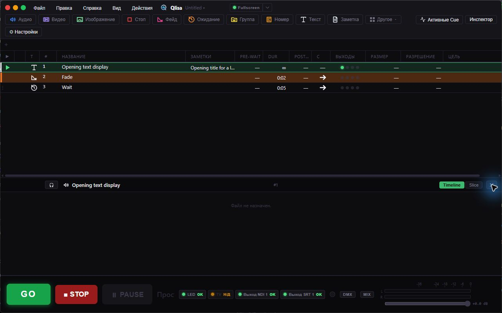
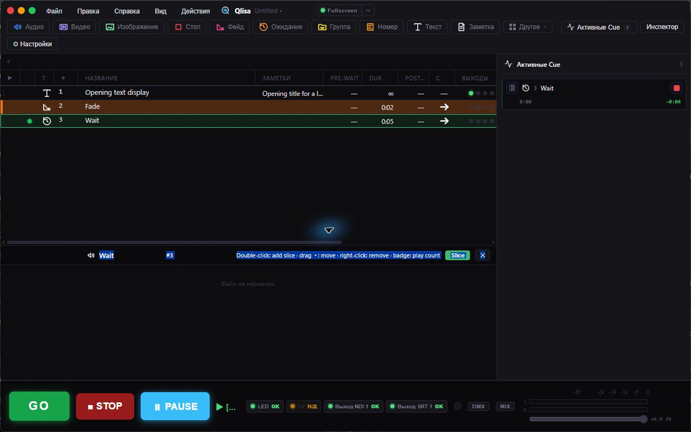
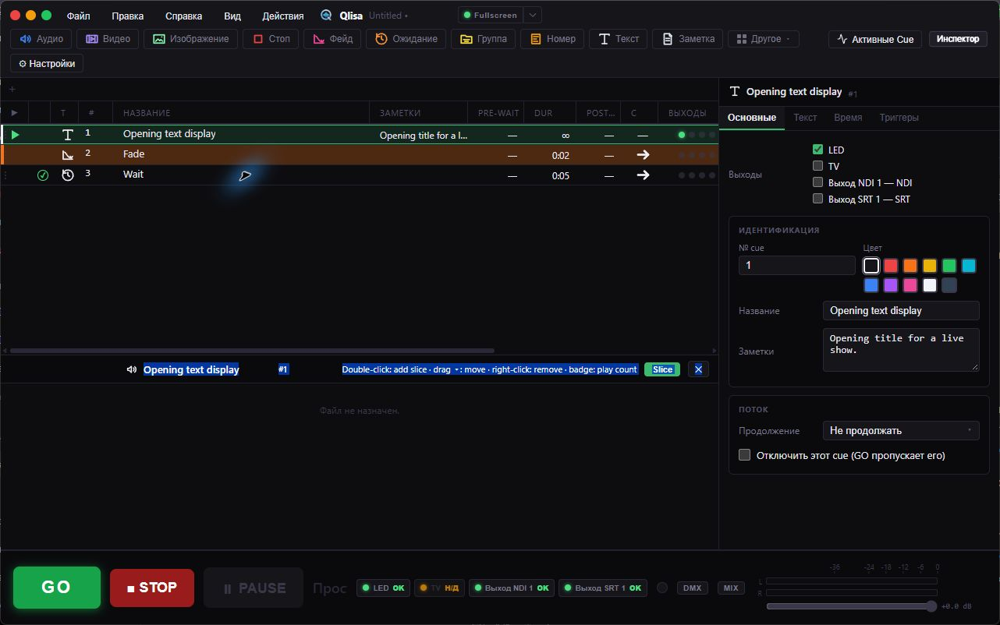

<strong>Русский</strong> | <a href="README.en.md">English</a>

  

  
  
  

  <a href="https://github.com/Ruslan-mad/Qlisa/releases/latest"><strong>⬇ Скачать Qlisa для Windows</strong></a> ·
  <a href="#скриншоты">Скриншоты</a> ·
  <a href="docs/README.md">Документация</a> ·
  <a href="https://github.com/Ruslan-mad/Qlisa/issues">Сообщить об ошибке</a>

# Qlisa

**Qlisa помогает запускать звук, видео, изображения и другие команды во время концертов, спектаклей, презентаций и других живых мероприятий.** Подготовьте последовательность действий заранее, а во время шоу запускайте её кнопкой **GO**.

Вместо отдельных плееров и папок со случайно названными файлами шоу хранится в одном проекте. Например, один Cue может запустить музыку, следующий — вывести заставку, а после ролика автоматически начнётся следующий номер.

Во время шоу Qlisa помогает:

- включить музыкальный трек;
- запустить видео или показать изображение и текст;
- плавно изменить громкость или вывести звук на нужное устройство;
- автоматически запустить следующий Cue;
- отправить команду другому оборудованию или программе;
- вывести разный контент на несколько экранов.

## Как работает Cue List и GO

**Cue** — это одно действие шоу: например, воспроизвести аудио, показать видео или текст, подождать, изменить уровень звука или отправить команду внешней системе. **Cue List** — упорядоченный список таких действий. В нём можно подготовить весь ход шоу и настроить файлы, уровни, выходы и задержки.

**Playhead** указывает Cue, который запустится при следующем нажатии **GO**. После запуска Playhead переходит дальше по списку. Панель **Active Cues** показывает уже запущенные Cue и их состояние. **STOP** останавливает выбранное воспроизведение по его обычным правилам; для немедленной остановки есть Hard Stop.

Для автоматического перехода можно выбрать режим продолжения. **Автопродолжение (Auto-Continue)** запускает следующий Cue после заданной задержки, отсчитываемой от начала текущего действия; поэтому Cue могут перекрываться. **Автопереход (Auto-Follow)** запускает следующий Cue после завершения текущего действия и его задержки.

В Cue List стрелки **↑/↓** переходят по видимым строкам и перемещают Playhead; **Пробел** запускает выбранный Cue. Двойной щелчок по группе или номеру раскрывает или сворачивает его. Стрелки **←/→** сворачивают и раскрывают сфокусированную группу или номер.

## Скриншоты

| Активные Cue | Инспектор Cue |
| --- | --- |
|  |  |

## Возможности

### Звук, видео и изображения

- Воспроизведение аудио и видео, показ изображений и текста.
- Громкость, плавное появление и затухание, обрезка начала и конца, перемотка и циклическое воспроизведение.
- Выбор аудиоустройств, микширование и прослушивание в наушниках.
- Прослушивание в наушниках начинается с позиции курсора на временной шкале редактора; кнопки воспроизведения, паузы и перемотки управляют активным предпрослушиванием.
- Несколько экранных выходов и маршрутизация визуальных Cue на нужные выходы.
- Отдельная геометрия изображения для разных выходов.

### Типы Cue и управление шоу

Доступны Audio, Video, Image, Text, Memo, Wait, Fade, Stop, Group, Number и другие Cue. Есть задержки до и после действия, циклы, управление другими Cue и группы с последовательным или параллельным запуском.

Настраиваемые автоматические переходы дополняют управление через Playhead, GO, STOP и панель Active Cues. Рядом с проектом сохраняются кэш waveform и предпросмотра медиа.

### Подключение к другим системам

Qlisa поддерживает MIDI, OSC, Timecode, sACN, Art-Net, NDI и SRT. Cue может запускать медиа и отправлять команды совместимой программе или системе.

Для работы с NDI установите официальный [NDI Runtime](https://ndi.video/) отдельно. Qlisa не включает его в установщик.

### Конвертация и импорт

Встроенные инструменты конвертируют аудио, видео и изображения; для обработки и анализа медиа используются FFmpeg и ffprobe. Поддерживается импорт проектов QLab для переноса подготовленных списков Cue.

## Установка

Qlisa предназначена для **Windows 10 и Windows 11**. Установщик устанавливает программу для всех пользователей компьютера в `C:\Program Files\Qlisa` и может запросить права администратора.

1. Откройте [страницу последнего релиза](https://github.com/Ruslan-mad/Qlisa/releases/latest) и скачайте установщик Windows.

2. Запустите установщик и завершите установку.

3. Запустите Qlisa. Для первого запуска нужен интернет: программа загрузит компоненты Media Runtime.

NDI Runtime требуется только при использовании NDI. Установите его отдельно с [сайта NDI](https://ndi.video/).

## Проекты

Новые проекты используют расширение `.qlisa`. Qlisa также открывает проекты `.inkue`; оба расширения используют одну структуру рабочего пространства. Храните файлы медиа в доступных местах и проверьте пути к ним при переносе проекта на другой компьютер.

## Обновления и Media Runtime

Qlisa проверяет обновления приложения через GitHub Releases. Обновление запускает пользователь из программы. Пока воспроизводятся Cue, установка обновления откладывается.

При первом запуске Qlisa скачивает FFmpeg, ffprobe и libmpv напрямую из закреплённых выпусков upstream-проектов, проверяет контрольные суммы SHA-256 и сохраняет компоненты в `%LOCALAPPDATA%\Qlisa\runtime`. При последующих запусках программа проверяет файлы и скачивает их заново, если они отсутствуют или повреждены. Если загрузка не удаётся, Qlisa показывает причину и кнопку «Повторить». Выбирать FFmpeg или libmpv вручную не нужно. Для первой загрузки и восстановления нужен интернет. Установщик Qlisa не содержит эти компоненты.

Подробнее: [Media Runtime в Windows](docs/windows-network-runtime.md).

## Состояние проекта

Qlisa активно развивается. Интерфейс доступен на русском и английском. Основная платформа релизов — Windows 10 и Windows 11. Официальные версии для macOS и Linux не выпускаются. Сообщайте об ошибках и предлагайте улучшения в [GitHub Issues](https://github.com/Ruslan-mad/Qlisa/issues).

## Разработка

Для сборки нужны Windows 10 или 11, Rust stable, Node.js, pnpm, компоненты Tauri 2, Visual Studio C++ Build Tools и Windows SDK. Инструкции по настройке, сборке и устройству проекта находятся в [руководстве разработчика](docs/PROJECT_GUIDE.md).

## Проект Inkue

Qlisa создана на основе открытого проекта [Inkue от FonograF](https://github.com/FonograF/Inkue). Благодарим автора и участников Inkue за исходный проект.

## Лицензия

Qlisa распространяется по лицензии [GPL-3.0-or-later](LICENSE). Для сторонних компонентов действуют отдельные лицензии и уведомления: [THIRD_PARTY_NOTICES.md](THIRD_PARTY_NOTICES.md).

## Документация

Технические руководства в docs пока доступны на английском; заметки о версии 1.5.11 опубликованы на русском и английском.
Описание навигации и предпрослушивания отражает исходный код после 1.5.11; эти исправления не входят в опубликованную версию 1.5.11. Ручные проверки перечислены в [чеклисте следующих исправлений](docs/BUGFIXES_NEXT.md).

- [Документация Qlisa](docs/README.md)
- [Руководство разработчика](docs/PROJECT_GUIDE.md)
- [Подготовка релиза](docs/RELEASING.md)
- [Список изменений версии 1.5.11](docs/RELEASE_NOTES_1.5.11.md)
- [Чеклист следующих исправлений](docs/BUGFIXES_NEXT.md)
- [Лицензия](LICENSE) · [Сторонние компоненты](THIRD_PARTY_NOTICES.md)
