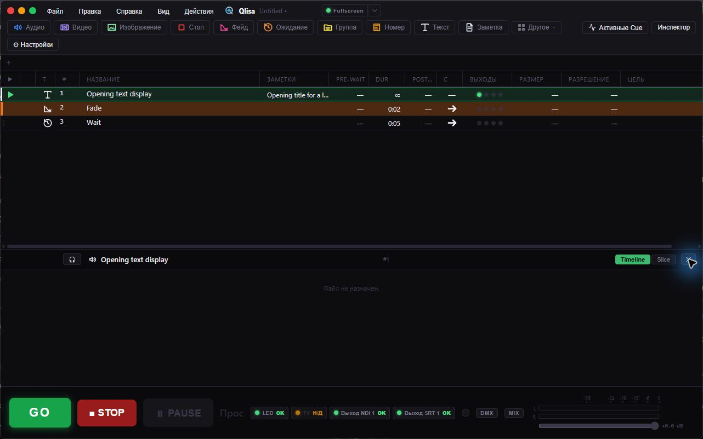
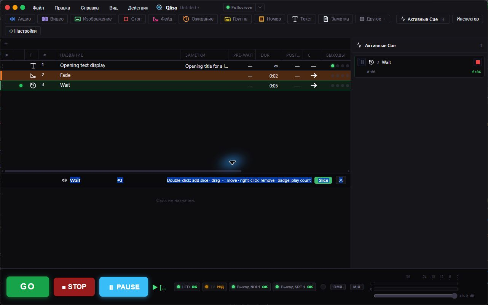
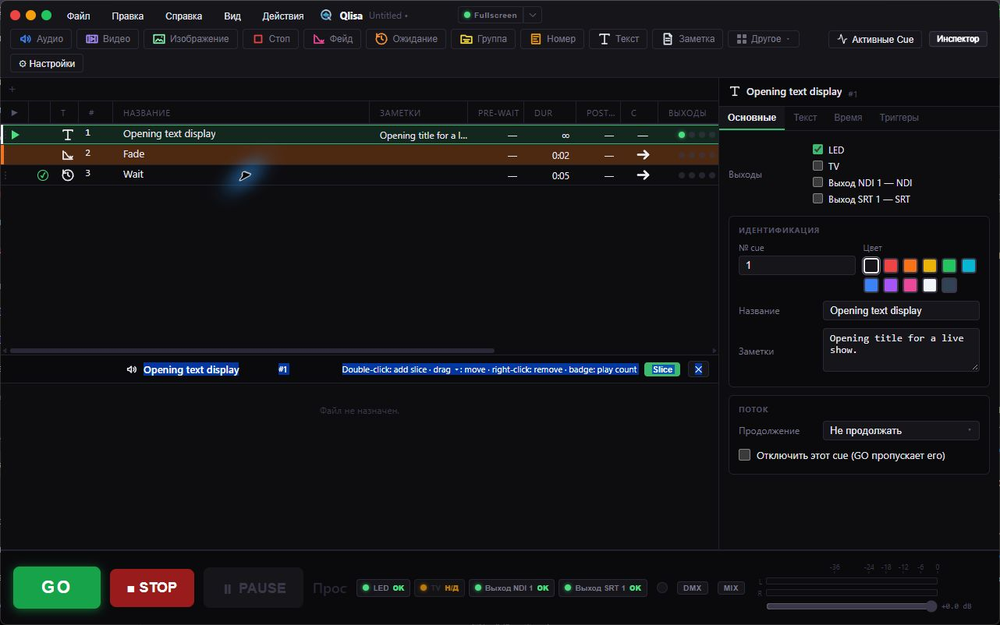

<a href="README.md">English</a> | <strong>Русский</strong>

  

  
  
  
  
  

  <a href="https://github.com/Ruslan-mad/Qlisa/releases/latest"><strong>Скачать Qlisa для Windows</strong></a> ·
  <a href="https://github.com/Ruslan-mad/Qlisa/releases">Все релизы</a> ·
  <a href="docs/README.md">Документация</a> ·
  <a href="#скриншоты">Скриншоты</a> ·
  <a href="https://github.com/Ruslan-mad/Qlisa/issues">Сообщить об ошибке</a> ·
  <a href="https://github.com/Ruslan-mad/Qlisa">Исходный код</a>

Qlisa — cue-система для подготовки и проведения концертов и сценических мероприятий на Windows. Соберите список Cue, выберите следующий Cue с помощью Playhead и запустите его кнопкой **GO**. Звук, видео, изображения, группы, тайминг и маршрутизация выходов работают в одном проекте шоу.

Qlisa — развиваемый сообществом форк [Inkue от FonograF](https://github.com/FonograF/Inkue). В текущей версии исходников новые проекты создаются с расширением `.qlisa`, а «Сохранить как» предлагает его по умолчанию. Если явно выбрать старое расширение `.inkue` или `.wincue`, оно сохранится. Оба расширения используют одну JSON-схему рабочего пространства. Ассоциация файлов `.qlisa` планируется для будущего релиза и пока не входит в установщик выпущенной версии 1.5.6.

## О программе

В Qlisa можно подготовить Cue List и управлять шоу во время выступления. Cue запускают медиафайлы, управляют другими Cue, задают задержки или отправляют команды подключённым системам. Playhead выбирает следующий Cue; **GO**, **STOP** и транспортные команды управляют воспроизведением.

## Скриншоты

| Активные Cue | Инспектор |
| --- | --- |
|  |  |

## Возможности

- Audio, Video, Image, Text, Memo, Wait, Fade, Stop, Group и Number Cue; тайминг, затухания, обрезка, перемотка, циклы, Auto-Continue и Auto-Follow.
- Панели Active Cues и Inspector, именованные видео-выходы, маршрутизация Cue, аудиомикшер и прослушивание в наушниках.
- MIDI, OSC, timecode, освещение по sACN/Art-Net, SRT и вход/выход NDI. Для NDI требуется отдельно установленный NDI Runtime.
- Конвертация аудио, видео и изображений. Для конвертации и анализа медиа используются FFmpeg и ffprobe.
- Импорт проектов QLab, интерфейс на русском и английском, диагностика и восстановление после сбоя.

## Установка

1. Откройте [последний релиз Qlisa](https://github.com/Ruslan-mad/Qlisa/releases/latest).
2. Скачайте установщик для Windows и запустите его. Windows может запросить права администратора, чтобы установить Qlisa для всех пользователей.
3. Запустите Qlisa. При первом старте приложение скачает и проверит необходимые компоненты Media Runtime.

NDI нужен только для работы с источниками и выходами NDI. Установите официальный [NDI Runtime](https://ndi.video/) отдельно. Qlisa не распространяет и не устанавливает его.

## Media Runtime и обновления

При первом запуске Qlisa скачивает закреплённые версии FFmpeg, ffprobe и libmpv с постоянных страниц релизов upstream-проектов. Приложение проверяет SHA-256 и хранит файлы в `%LOCALAPPDATA%\Qlisa\runtime`. При следующих запусках Qlisa проверяет компоненты и восстанавливает отсутствующие или повреждённые файлы. Подробности — в [заметках о runtime для Windows](docs/windows-network-runtime.md).

Qlisa проверяет подписанные обновления приложения через GitHub Releases. Обновление запускает сам пользователь из приложения. Пока работают Cue, Qlisa обновление не устанавливает.

## Сборка из исходников

Поддерживаемая платформа разработки и сборки — Windows 10 или 11. Нужны Rust stable, Node.js, pnpm, компоненты Tauri 2, Visual Studio C++ Build Tools и Windows SDK. Установите зависимости командой `pnpm install`; команды сборки и требования описаны в [руководстве по проекту](docs/PROJECT_GUIDE.md).

## Состояние проекта

Qlisa активно развивается для Windows. macOS и Linux пока не являются поддерживаемыми платформами для релизов.

## Происхождение и лицензия

Qlisa — производный проект [Inkue](https://github.com/FonograF/Inkue), созданного FonograF. Спасибо участникам Inkue за основу, на которой выросла Qlisa.

Qlisa распространяется по лицензии [GPL-3.0-or-later](LICENSE). Для сторонних компонентов действуют отдельные условия и уведомления: [THIRD_PARTY_NOTICES.md](THIRD_PARTY_NOTICES.md).

## Документация

- [Содержание документации](docs/README.md)
- [Руководство по проекту](docs/PROJECT_GUIDE.md)
- [Подготовка релиза](docs/RELEASING.md)
- [Список изменений версии 1.5.6](docs/RELEASE_NOTES_1.5.6.md)
- [Лицензия](LICENSE) · [Уведомления о сторонних компонентах](THIRD_PARTY_NOTICES.md)
